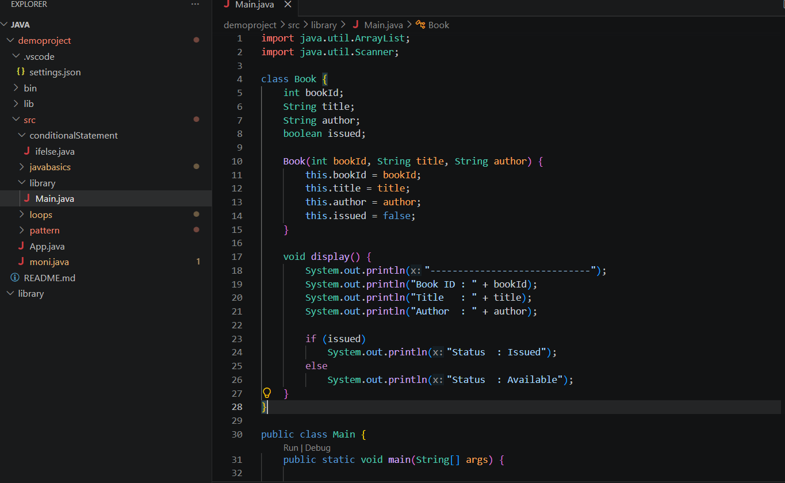
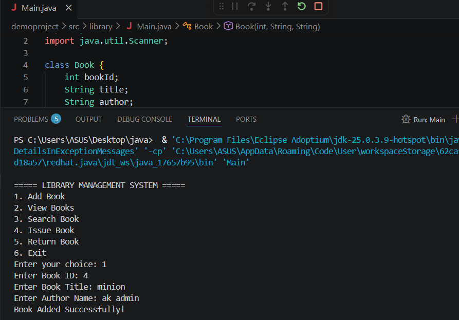

# Library-Management-System

A simple **Library Management System** developed in **Java** that allows users to manage library books efficiently. This project demonstrates the use of Java programming concepts such as classes, objects, arrays, loops, methods, and conditional statements.


## Features

-  Add new books
-  Display all books
-  Search books by title
-  Issue books
-  Return books
-  Exit the application


## Technologies Used

- Java
- VS Code / IntelliJ IDEA
- Git
- GitHub


## Project Structure


Library-Management-System/
│── Main.java
│── README.md


## How to Run the Project

1. Clone the respository

2. Open the project in VS Code or IntelliJ IDEA.

3. Compile the program:
javac Main.java

4. Run the program:
java Main


## Sample Output

```
===== Library Management System =====
1. Add Book
2. Display Books
3. Search Book
4. Issue Book
5. Return Book
6. Exit

Enter your choice:

## Learning Objectives

This project helped me practice:
- Java Basics
- Object-Oriented Programming (OOP)
- Methods
- Arrays
- Loops
- Conditional Statements
- Git & GitHub


GitHub: https://github.com/Monisha8199


##Screenshots

### Project Structure



### Program Output



### Demo Video

A demonstration video of the project is available in the `assets` folder.

- `Screen Recording 2026-07-03 194719.mp4`
